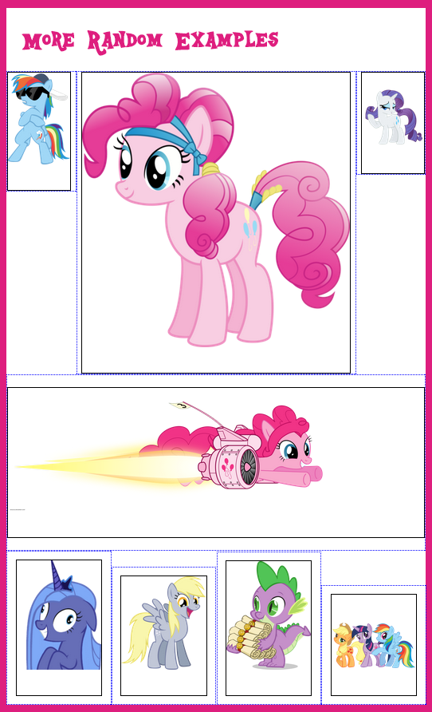

#PINK GRID & PINK ROW
###Sass Width/Padding Percentage Generators
*Version 0.1*

Inclue this file to easily generate widths/padding for items and build a grid for your site.
No more dealing with annoying floats, rows, and clears! Using the magic of display: inline-block

Use `@include pinkgrid` to generate widths and padding for your own class-based grid system ( 1col, 2col, full, etc. ) or simply add directly to items.
Use`@include pinkrow` to remove the outer padding 
Use with media queries for even more responsive goodness!

`@include pinkgrid( $align, $totalcols, $colspan, $padtop, $padside )`

* $defaultcols:	12 	Change this value to set the global number of columns in your grid system
* $defaultpad:	1%	Change this value to set the global padding percentage in your grid system
* $align:		Vertical-align property 													Defaults to Top
* $totalcols: 	Number of columns in your grid ( ex: 12 ) 									Defaults to $defaultcols
* $colspan: 	Number of columns your item spans ( ex: 3 / 12 ) 							Defaults to $defaultcols (100% width)
* $autopad:		If true, it will automatically calculate side padding based on $rowitems. 	Defaults to False
* $padside:		If $autopad is false, it will use this value to manually add side padding. 	Defaults to $defaultpad
* $padtop:		Padding above/below around each item. 										Defaults to 0

`@include pinkrow( $rowitems, $skipitems )`

* $rowitems:	Number of items per row ( ex. 4 ), used with $autopad. 						Defaults to 1
* $skipitems:	For alternating row layouts, # of items to skip in nth-of-type calcs		Defaults to 0

For example: 

`@include pinkgrid( $colspan: 3 )` will generate an object that spans 3 out of 12 columns ( 25% ) with 1% padding

`@include pinkgrid( $totalcols: 6, $colspan: 3 )` will generate an object that spans 3 out of 6 ( 50% ) columns with 1% padding

`@include pinkgrid( $colspan: 3 ) @include pinkrow( $rowitems: 4 )` will generate an object that spans 3 out of 12 columns ( 25% ) but will remove the outside padding of the first and last item in each row, based on having 4 items per row

*Check out the example html/scss files for more ideas!*

###Example screenshots:

